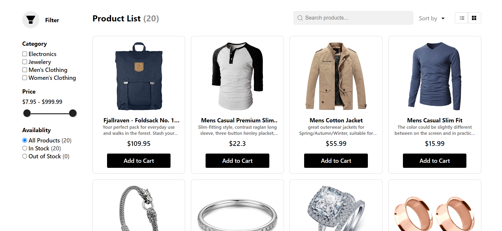
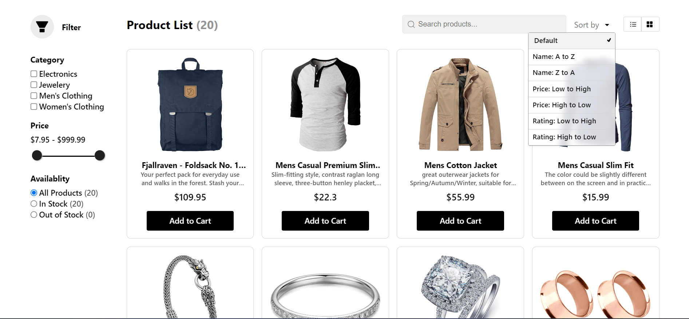
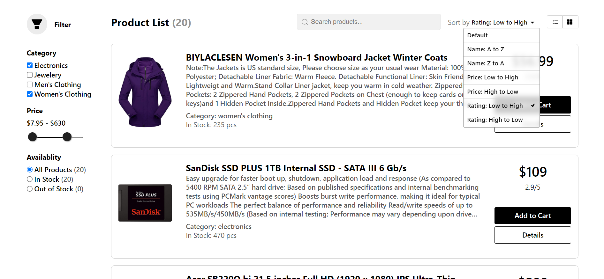
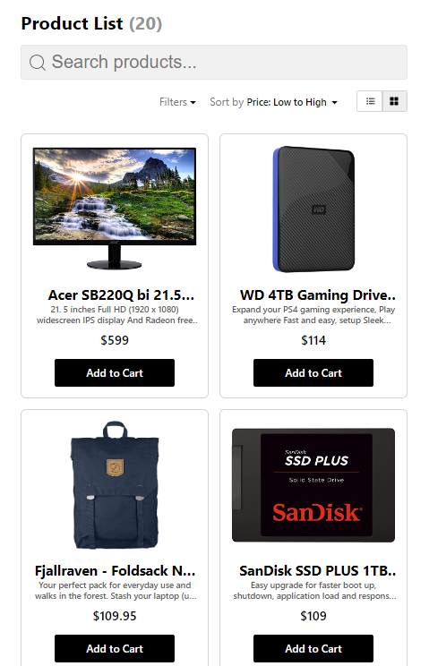
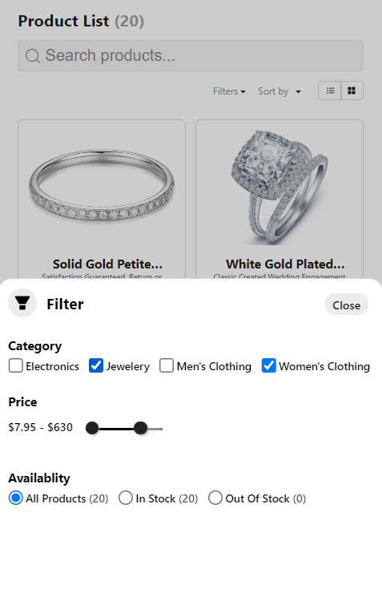

# E-Commerce Product List

It is a responsive e-commerce product listing page with multiple features using React.js.

#### Features

-   Fetch products
-   Search by title
-   Filter by category, price and availability
-   Sort by product name, price and rating
-   Toggle between grid and list views
-   Fully responsive
-   Pagination

## Prerequisites

Ensure you have the following software installed on your machine:

-   **Node.js**: Download and install from [nodejs.org](https://nodejs.org/)
-   **npm**: Comes with Node.js. You can also use `yarn` as an alternative. Install Yarn from [yarnpkg.com](https://yarnpkg.com/)

## Installation

1. **Clone the repository**:

    ```bash
    git clone https://github.com/shzzd/nextgen-landing-page-assignment.git
    cd nextgen-landing-page-assignment.git
    ```

2. **Install dependencies**:

    Using npm:

    ```bash
    npm install
    ```

    Or using Yarn:

    ```bash
    yarn install
    ```

## Running the Application

To run the application in development mode, execute the following command:

Using npm:

```bash
npm start
```

## Components Structure

App -> Pages -> Product List Page -> Product List

#### Product List-> Header - List - Filter

-   Header
    -   Title
    -   Options
        -   Search Bar
        -   Container
            -   Filter Pop Up (Mobile)
            -   Sort
            -   List/Grid View
-   List
    -   List View
    -   Grid View
    -   Pagination
-   Filter
    -   Title
    -   Category Filter
    -   Price Range Filter
    -   In Stock/Out of Stock Filter

#### Resources

-   Button Template
-   List View
-   Grid View
-   Multi Range

## Desktop View







## Mobile View




